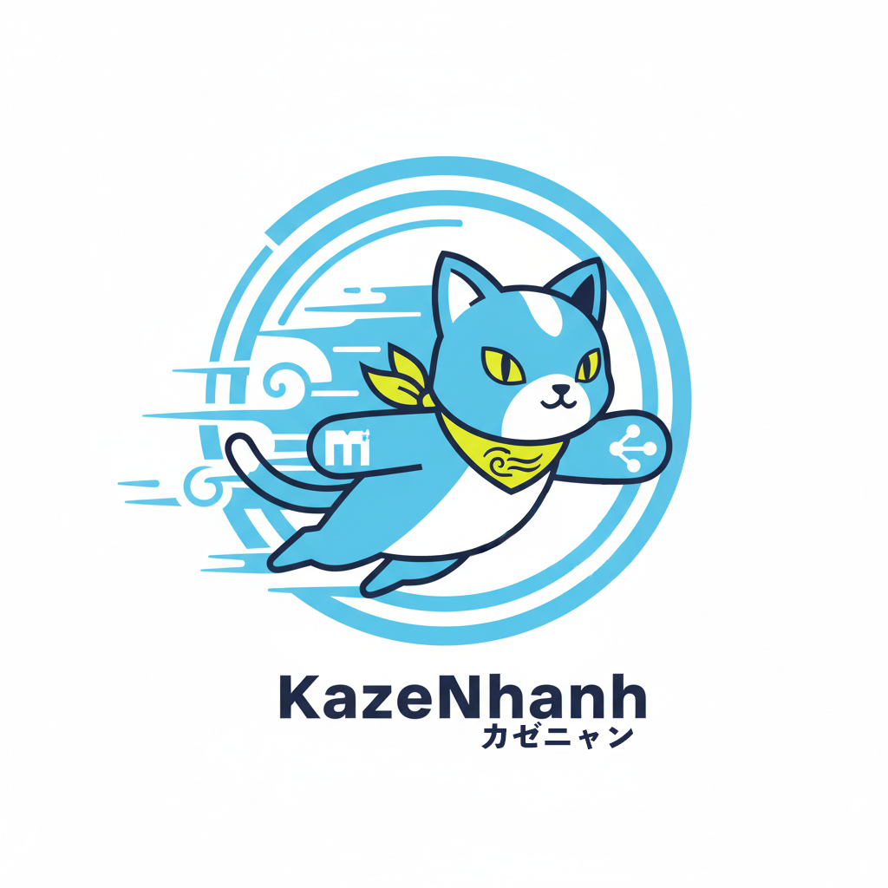

# KazeNhanh



KazeNhanh は、Git の変更差分と軽量推論パイプラインを組み合わせてドキュメントを要約・可視化するための Rust ライブラリです。GitNativeRAG、HybridSummarizer、NLP/Markdown 基盤サービスを統合し、プロダクション品質のテストと CI を備えています。

## プロジェクト概要
- Rust 1.75+ で動作するライブラリ (`kaze_nhanh`) を提供
- Git 差分収集・Markdown 構造解析・Sudachi ベースの日本語 NLP を統合
- HybridSummarizer と GitNativeRAG パイプラインで差分要約や合成要約を生成
- ThreadSanitizer や Criterion/ソークテストを含む CI パイプラインで品質保証

## 特長
- **Git ネイティブな差分収集**: 直近コミットから Markdown 追加行を抽出し、要点レポート化
- **ハイブリッド要約**: LexRank による重要文抽出と推論ベースの合成による多段要約
- **Sudachi NLP サポート**: インメモリ辞書を扱う形態素解析と文分割ユーティリティ
- **堅牢なエラーモデル**: `KazeNhanhError` による詳細な失敗理由とテストでの検証
- **完全な CI**: `cargo fmt` / `cargo test` / `cargo llvm-cov` / ThreadSanitizer / Criterion / ソークを自動実行

## 迅速な利用開始

### 依存関係
- Rust 1.75 以降 (Rustup 推奨)
- Sudachi 辞書 (`system.dic`) と設定 (`sudachi.json`) をインメモリで取り扱うためのバイナリ
- (任意) GGUF 形式のモデルファイル — モック実装は同梱されており、実モデルは別途取得してください

### インストール
リポジトリをクローンしてライブラリをビルドします。

```powershell
git clone https://github.com/siska-tech/KazeNhanh.git
cd KazeNhanh
cargo build --all
```

アプリケーションから利用する場合は、`Cargo.toml` に Git 依存として追加できます。

```toml
[dependencies]
kaze_nhanh = { git = "https://github.com/siska-tech/KazeNhanh", tag = "v0.1.0" }
```

## 使い方のヒント

### Git 差分レポート

```rust
use kaze_nhanh::{foundation::git_service, GitReportOptions};

let options = GitReportOptions {
    repo_path: "./docs",
    days_since: 7,
    target_extensions: None,
    custom_prompt: None,
};

let ctx = git_service::prepare_repository(&options)?;
let diffs = git_service::collect_markdown_diffs(&ctx, &options.effective_extensions())?;
```

### ハイブリッド要約パイプライン

```rust
use kaze_nhanh::{pipeline::hybrid_summarizer::HybridSummarizer, EngineConfig};

let engine = EngineConfig::new(MODEL_BYTES, DICT_BYTES, SETTINGS_BYTES);
let summarizer = HybridSummarizer::default();
let summary = summarizer.execute(&engine, &diffs)?;
```

### NLP ユーティリティ

```rust
use kaze_nhanh::foundation::nlp::{split_sentences, NlpService};

let sentences = split_sentences("風が吹けば桶屋が儲かる。雨が降る?");
let tokens = NlpService::new(&engine)?.tokenize(&sentences[0])?;
```

Sudachi 辞書はライセンスの都合で同梱していません。利用時は公式配布物を取得し、`include_bytes!` などでインメモリ展開してください。

## 品質保証と CI
- `cargo fmt --all -- --check` : Rustfmt 準拠を確認
- `cargo test --all --all-features` : ユニット・結合テスト
- `cargo llvm-cov --lcov --output-path coverage/lcov.info` : カバレッジ計測
- `cargo bench --features mock_inference --bench performance` : Criterion パフォーマンステスト
- `pwsh ./scripts/soak/run_soak.ps1 -DurationMinutes 5 -IntervalSeconds 60` : 短時間ソーク

`.github/workflows/testing.yml` では次の 3 ジョブを定義しています。

| Job | 内容 |
| --- | --- |
| `tests` | `cargo fmt --check`, `cargo test`, `cargo llvm-cov` を実行し、`coverage/lcov.info` をアーティファクト化 |
| `thread-sanitizer` | Nightly + `-Z sanitizer=thread` で並行性テストを実行 |
| `performance` | Criterion ベンチと PowerShell ソークテストを実施し、結果をアーティファクト保存 |

## プロジェクト構成
- `src/` : コアライブラリ (foundation, inference, pipeline)
- `benches/` : Criterion ベンチマーク
- `scripts/soak/` : PowerShell ソークテストスクリプト
- `tasks/` : タスク・サブタスクとロードマップの管理
- `docs/` : 詳細設計や利用ガイド

## 開発進捗
- 2025-11-08: ThreadSanitizer ジョブのテストフィルタを修正し、並行性テスト実行を安定化。
- 2025-11-08: デモ用Gitリポジトリ (`task-demo-001-git-sample-repo`) を整備し、Tauriデモで使用するブランチ・タグ・衝突シナリオを追加。
- 2025-11-08: CI/CD 統合 (`subtask-testing-001-06-ci`) を完了し、テスト・ThreadSanitizer・性能計測を自動化。
- 2025-11-07: パフォーマンス/ソーク基盤 (`subtask-testing-001-05-performance`) を整備し、Criterion と soak スクリプトを公開。
- 2025-11-07: GitNativeRAG パイプライン (`task-pipeline-002-git-native-rag`) を完成させ、差分要約フローを確立。
- 2025-11-07: HybridSummarizer (`task-pipeline-001-hybrid-summarizer`) を実装し、LexRank/推論合成パスを追加。
- 2025-11-07: 推論エンジン (`task-inference-001-inference-engine`) を完成させ、GGUF ロードとトークナイザー共有を実装。
- 2025-11-07: コアエンジン/基盤サービス (`task-core-001-*`, `task-foundation-00*-*`) を揃え、公開 API を安定化。

詳細なタスクリストと今後の計画は `tasks/ROADMAP.md` を参照してください。

## コントリビューション
Issue や Pull Request を歓迎します。大きな変更の場合は事前に議論してください。スタイルは `cargo fmt` を適用し、テストとカバレッジを通過させてください。

## ライセンス
このプロジェクトは `LICENSE` ファイルに記載されたライセンスの下で提供されます。

## 謝辞
KazeNhanh は Rust コミュニティと Sudachi/Candle エコシステムの恩恵を受けています。貢献者の皆さまに感謝します。

---

# KazeNhanh (English)


KazeNhanh is a Rust library that fuses Git diff analysis with lightweight inference pipelines to summarize and surface documentation changes. It bundles GitNativeRAG, HybridSummarizer, and shared NLP/Markdown services, backed by production-grade testing and CI automation.

## Overview
- Ships the `kaze_nhanh` library targeting Rust 1.75+
- Unifies Git diff collection, Markdown structure analysis, and Sudachi-based Japanese NLP
- Generates diff summaries and synthesized reports via HybridSummarizer and GitNativeRAG pipelines
- Ensures quality with CI jobs covering ThreadSanitizer, Criterion benchmarks, and soak testing

## Highlights
- **Git-native diff ingestion**: extracts added Markdown lines from recent commits to build concise reports
- **Hybrid summarization**: combines LexRank sentence ranking with inference-powered synthesis
- **Sudachi NLP support**: in-memory dictionary handling plus sentence segmentation utilities
- **Robust error model**: rich `KazeNhanhError` variants validated by extensive tests
- **Comprehensive CI**: automates `cargo fmt`, `cargo test`, `cargo llvm-cov`, ThreadSanitizer, Criterion, and soak runs

## Getting Started Fast

### Prerequisites
- Rust 1.75 or later (via Rustup)
- Sudachi resources (`system.dic`, `sudachi.json`) loadable in-memory
- (Optional) GGUF model files — mock inference assets are bundled; real models must be supplied separately

### Installation
Clone the repository and build the library:

```powershell
git clone https://github.com/siska-tech/KazeNhanh.git
cd KazeNhanh
cargo build --all
```

To consume it from another crate, add a Git dependency:

```toml
[dependencies]
kaze_nhanh = { git = "https://github.com/siska-tech/KazeNhanh", tag = "v0.1.0" }
```

## Usage Tips

### Git Diff Reports

```rust
use kaze_nhanh::{foundation::git_service, GitReportOptions};

let options = GitReportOptions {
    repo_path: "./docs",
    days_since: 7,
    target_extensions: None,
    custom_prompt: None,
};

let ctx = git_service::prepare_repository(&options)?;
let diffs = git_service::collect_markdown_diffs(&ctx, &options.effective_extensions())?;
```

### Hybrid Summarization Pipeline

```rust
use kaze_nhanh::{pipeline::hybrid_summarizer::HybridSummarizer, EngineConfig};

let engine = EngineConfig::new(MODEL_BYTES, DICT_BYTES, SETTINGS_BYTES);
let summarizer = HybridSummarizer::default();
let summary = summarizer.execute(&engine, &diffs)?;
```

### NLP Utilities

```rust
use kaze_nhanh::foundation::nlp::{split_sentences, NlpService};

let sentences = split_sentences("When the wind blows, the cooper prospers.");
let tokens = NlpService::new(&engine)?.tokenize(&sentences[0])?;
```

Sudachi dictionaries are not bundled for licensing reasons. Obtain the official distribution and embed it (e.g., via `include_bytes!`) when deploying.

## Quality & CI
- `cargo fmt --all -- --check`: enforce Rustfmt style
- `cargo test --all --all-features`: run unit and integration tests
- `cargo llvm-cov --lcov --output-path coverage/lcov.info`: capture coverage reports
- `cargo bench --features mock_inference --bench performance`: execute Criterion benchmarks
- `pwsh ./scripts/soak/run_soak.ps1 -DurationMinutes 5 -IntervalSeconds 60`: perform a short soak run

`.github/workflows/testing.yml` defines three jobs:

| Job | Details |
| --- | --- |
| `tests` | Runs `cargo fmt --check`, `cargo test`, `cargo llvm-cov`, then uploads `coverage/lcov.info` |
| `thread-sanitizer` | Executes concurrency tests using nightly Rust with `-Z sanitizer=thread` |
| `performance` | Runs Criterion benches plus the PowerShell soak script and stores artifacts |

## Repository Layout
- `src/`: core library modules (foundation, inference, pipeline)
- `benches/`: Criterion benchmark suites
- `scripts/soak/`: PowerShell soak testing scripts
- `tasks/`: task and subtask tracking plus roadmap
- `docs/`: design notes and usage guides

## Project Progress
- 2025-11-08: Completed CI/CD integration (`subtask-testing-001-06-ci`) with automated tests, ThreadSanitizer, and performance runs
- 2025-11-07: Finalized performance/soak tooling (`subtask-testing-001-05-performance`) and published Criterion + soak workflows
- 2025-11-07: Delivered GitNativeRAG pipeline (`task-pipeline-002-git-native-rag`) enabling diff-to-summary flows
- 2025-11-07: Implemented HybridSummarizer (`task-pipeline-001-hybrid-summarizer`) with LexRank and inference synthesis
- 2025-11-07: Completed inference engine (`task-inference-001-inference-engine`) with GGUF loading and tokenizer sharing
- 2025-11-07: Stabilized core engine & foundation services (`task-core-001-*`, `task-foundation-00*-*`) for the public API

See `tasks/ROADMAP.md` for the full backlog and future plans.

## Contributing
We welcome issues and pull requests. For larger changes, please start a discussion first. Run `cargo fmt`, ensure all tests and coverage checks pass, and follow the repository guidelines.

## License
Provided under the license terms described in the `LICENSE` file.

## Acknowledgements
KazeNhanh benefits from the Rust community and the Sudachi/Candle ecosystems. Thank you to all contributors.


