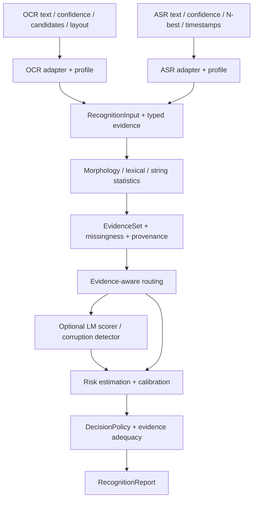

# KZN-REDESIGN-PLAN-002: OCR/ASR recognition risk基盤

- 作成日: 2026-10-04 (Asia/Tokyo)
- 監査対象: `2d2e111`、0.2開発版 / `kzn.evaluation.v3`
- 状態: ユーザーの目的変更を反映した計画。R0/R1実装済み。R2は統計evidence・資産を先行実装して進行中、検出/fusion・実品質は未受入。[R1 API](recognition-source-evidence.md)。[R0 API](recognition-api.md)。
- 優先順位: 今後の目的・移行順は本書を優先。旧PLAN-001の監査履歴、P0〜P2実績、API-SPEC-002の現行動作は保持する。
- 実装追跡: [移行タスク](../tasks/task-redesign-002-text-evaluation-migration.md)。以下は設計時の提案、実装済み範囲はR0 API文書を参照。

## 1. 新しい目的と評価対象

KazeNhanhを「機械認識されたテキストについて、形態素・語彙・文字列統計・言語モデル・認識器のconfidenceと候補情報を統合し、異常・不確実性・誤認識リスクを評価するローカル基盤」と定義する。OCR/ASR共通のrecognition riskが主対象、naturalnessは補助証拠とする。detection first、CPU-first、local-first、原文保持、訂正文を生成しない方針を維持する。

主な評価対象は「宣言した転記規約に従った原資料の転記と、認識結果との不一致」。意図・文章品質・事実性とは区別する。OCRの筆者自身の誤字、ASRの話者の言い間違いを、認識器が忠実に転記したなら認識誤りとして学習しない。ASRの逐語/整文、句読点、数字表記、OCRの空白/箇条書き等はversion付きcomparison policyで定義し、raw文字列も残す。

原資料や候補がなく、誤認識後も自然な別文になった場合、テキストだけでは個別の真偽を決定できない。出力は観測できる証拠と、対象集団で検証した推定の範囲に限定する。画像・音声の認識や再認識は呼出側の責務。原資料由来の測定値をadapterで受け取ることは可能だが、coreに画像/音声runtimeを導入しない。

## 2. 現実装の監査と実測の解釈

| 根拠 | 現状 | 変更の必要性 |
| --- | --- | --- |
| `crates/core/src/primary.rs`: `PrimaryRules::detect` | 警告0ならAcceptable、naturalnessは `1 - 0.2 * warnings`。辞書featuresを抽出しても語彙/語列の統計的評価はない | 「限定ルールで未検出」を低リスクと混同する集約を変更 |
| 同: `DomainProfile::builtin` | ja.ocr.v1 / ja.asr.v1は同じscreening設定 | 共通評価契約を保ち、source evidenceとprofileを独立させる |
| `crates/core/src/lib.rs`: `SourceAnnotation` | spanと任意JSON。confidenceの意味・粒度・欠測・候補の型契約がない | raw metadataは残し、判定用の型付きevidenceを追加 |
| 同: `Scores` / `DimensionCoverage` | 高いほど良い三軸、全体evaluated/unassessed中心 | 高いほど危険なriskを別型にし、処理範囲と証拠充足を分離 |
| `crates/core/src/secondary.rs` | worker制御と自然さ/意味の閾値・score合成が同居 | 実行制御を再利用し、risk evidenceのprotocolとdecisionを分離 |
| `crates/qwen/src/lib.rs` | prompt末尾の自然/不自然2ラベルlogitsを比較 | 認識誤り確率でも本文surprisalでもない。主経路の採用条件から外す |
| `examples/ocr_samples.rs` | confidence保持、参照との事後比較はあるが、confidence/N-bestは判定に未利用 | 観察runnerをmissingness・decision・coverageの評価へ拡張 |

[画像1の実測](ocr-samples-user-001.md): 5件中3件の転記不一致を一次gateが全て通過。明示した全件Qwen比較でもその3件はnaturalnessが0.999以上。[追加2画像](ocr-samples-user-002-003.md): 10件中5件の転記差（ユーザー確認済み1件、未確認転記由来4件）が全て一次gateを通過。追加10件のQwen推論は未実施。

全15件で8件の転記差候補、うち4件がユーザー確認済み不一致。これは小規模開発観察であり、8件を確定正解としてrecallを計算しない。「過す/過ごす」の転記差を自然さ異常と同一視しない。ASRの実測データは今回の集合にはないため、ASR品質は未評価。

問題はQwenだけではない。gateが無警告をacceptableへ変換し、語彙・候補・認識器情報が判定に参加していない。model交換の前に、契約と評価対象を変更する。

## 3. 残す部分・変更する部分

| 部分 | 方針 |
| --- | --- |
| facade / backend非依存core / Sudachi / legacyの分離 | 維持。Git・Markdown・RAG・要約を主経路へ戻さない |
| owned辞書、全形態素、POS/読み/OOV/正規化形、byte span、資産hash | 維持。形態素解析は特徴抽出器。解析成功や低OOVを正常証明にしない |
| 制御文字・反復・括弧等の説明可能rule | 異常証拠として維持。無警告時のnaturalness=1による合格を廃止 |
| 原文/annotation保持、厳格出力検証、Error/Reportの分離 | 維持・拡張。認識誤り、入力制約違反、API不正を分ける |
| 遅延ロード、有界queue、共有予算、deadline、故障時保留 | 実行基盤を維持。naturalness/semantic専用request・result・合成は変更 |
| 三軸scoreを満たすとacceptableになる契約 | recognition用途では置換。naturalness/制約/意味照合は補助diagnosticsへ |
| Qwen Naturalness Judge | 実験比較用に隔離。認識riskの推薦backend・合格根拠から除外 |
| setup/verify、固定bundle、token ID検証、CPU smoke | 維持。モデル互換性の検証と検出品質の受入は引き続き別 |
| LLM/Form/PlainText用途 | 既存screening APIを維持。認識入力のない用途へrecognition riskを無理に付けない |

LLM/formの機能を削除する提案ではない。共通features・workerを再利用しつつ、recognition APIの製品目的をOCR/ASRへ明確化する。

## 4. 目標構成と責務

- **SourceAdapter**: 認識器固有payloadを検証し、confidence、候補、source位置を共通evidenceへ写像する。OCRのbbox/行順/文字類似、ASRの時刻/音響score/同音候補/無音等の意味解釈はadapterに置く。音響scoreとdecoderのLM scoreは区別する。
- **RecognitionProfile**: 言語・domain・文体・転記規約、sourceの利用可能な信号、低リスク判断に必要な根拠、実行予算、重要誤りの重み、校正対象を宣言する。ja.ocr.handwriting、ja.asr.verbatim等は将来のprofile例で、検証前に採用済みとしない。
- **Core**: typed evidence、原文span、欠測、source非依存features、統合・routing・decision契約を持つ。OCR/ASR固有の閾値やengine別score変換は持たない。
- **EvidenceProvider / RiskEstimator / RiskCalibrator / DecisionPolicy**: 特徴の計算、推定、校正、運用判断を分離する。入力変換、モデルのLoRA等のadapter、校正artifactを同名のadapterとして混同しない。

初期はcoreの型とtrait、adapter module、既存Sudachiを実装する。新crateは依存分離が必要になった時点で追加し、空crateを先行して増やさない。

## 5. 入力・evidence契約案

`evaluate_recognition(RecognitionInput) -> RecognitionReport`を明示的に追加する。従来の`evaluate`と三軸scoreは同じ名前のまま意味を変えない。以下は設計案であり現在のRust型ではない。

| 要素 | 必須契約 |
| --- | --- |
| text / source / document_id / segment_id | 不変の認識原文、OCRかASRか、同一原資料内の単位。言語・domain・profileを記録 |
| recognizer | engine/model/version/decode設定の識別子。未提供はunknown。推定した版を埋めない |
| confidence observations | raw値、意味（posterior/logprob/logit/engine_score/unknown）、範囲・方向、集約法、粒度（字/token/語/行/発話）、対象span、校正IDまたは未校正 |
| candidates | 1-bestとN-bestの文字列・rank・raw score・score成分・生成由来・打切り情報。各候補は独自の座標を持ち、1-bestとのalignmentは別に保持 |
| source anchors | OCRのpage/bbox、ASRのtime等はadapter所有の参照。共通spanとの写像と写像不能を記録 |
| context | 同じdocument/発話の前後文脈、用語集、業務制約。評価用gold transcriptionはruntime入力と分離 |
| evidence state | observed / missing / unsupported / invalid / failed / budget_skippedと理由。値0と未提供を区別 |

`SourceAnnotation.data`はraw metadataの保持用として残すが、coreが任意のJSONキーを読んで採点しない。adapterが意味を宣言できないconfidenceはunknownのraw情報に留める。今回の行confidenceは定義・集約法が不明なengine scoreであり、字ごとのconfidenceに複製しない。

欠落した文字は出力原文にspanが存在しないため、推定できる場合は境界anchorと対応候補を別に持たせる。行/発話全体の脱落は、textだけでは存在自体を観測できない。source coverage情報がなければ「渡された認識テキストの範囲のみ評価」と明記し、原資料全体の完全性を保証しない。

各evidenceはcode・provider/artifact ID・値と単位・scope/span・計算法・由来・依存するevidence IDを持つ。OCR confidenceと同じdecoderから得た候補posterior、外部LMと同じLMを含むdecoder score等の相関を追跡し、独立とみなして単純加算しない。

N-bestは正解を含む保証がなく、打切り集合内のsoftmaxを全文候補空間のposteriorと呼ばない。scoreの尺度が不明ならrank・候補間文字差・一致率だけを使う。entropy/marginは比較可能なscoreと正規化法がある場合のみ、候補集合条件付きの特徴として返す。複数OCR viewやASR候補の長さが違う場合のalignment・削除/挿入位置もadapterで検証する。候補数、総byte/token数、alignment計算量には上限を設ける。

## 6. 統合する特徴と限界

| 層 | 初期候補 | 判断への使い方・限界 |
| --- | --- | --- |
| Morphology | OOV連続、POS/活用列、分割安定性、読み、正規化差 | 根拠の一部。固有名詞・新語・方言をOOVだけで誤りとしない。Sudachi累積costは確率にしない |
| Lexical plausibility | domain語彙頻度、複合語/連語、語・POS n-gram、数値/単位の組合せ | 辞書に存在する語への置換も対象。頻度欠落は未知、希少語を即誤りにしない |
| String / sequence | 文字n-gram、文字種遷移、孤立記号、反復、語境界・助詞列、局所的な逸脱 | 複数信号で候補化。箇条書き、型番、短文、口語の正常例を対照にする |
| Recognizer | confidence分布・低値区間、候補差、score margin、候補間不一致 | engine/source固有の意味と校正を維持。高confidence単独で合格しない |
| LM | 局所surprisal、長さで正規化したNLL、候補間の相対尤度 | 言語的な予測しにくさ。原資料との不一致確率ではない |
| Context | 同一文書の表記一貫性、用語/単位制約、前後発話との矛盾候補 | 原資料の誤りや実際の発言の矛盾の可能性を残す |
| Corruption detector | clean/corruptedのsegment分類・span/boundary検出 | 実認識誤りで学習・受入。自然な誤変換も含める |

LM surprisalは、固定tokenizer/文脈で `s_i = -log p(t_i | context, t_<i)` を計算する案。局所ピーク、平均/分位点、候補間差を保持する。tokenizer/モデル/文長が違うraw値を同じ閾値で比較しない。subwordの値を原文byte spanへ写像し、評価対象tokenと文脈tokenを区別する。masked LMのpseudo-likelihoodは別methodで、逐次maskの推論回数も計上する。

CPU baselineは文字/語n-gramと小さな線形等のfusionから始め、neural LMは選択的に追加する。語彙/統計assetには学習domain・license・version/hashを付ける。固有名詞の多い短文ではLMだけの判定が誤警報源になり得るため、未知domainと欠測も入力にする。

ASRでconfidenceの推定をtoken softmaxから別途行う研究は、この信号を単独の正解率と扱わない設計の参考になる。KazeNhanhでの性能を保証する根拠にはしない。[Woodward et al., 2020](https://www.isca-archive.org/interspeech_2020/woodward20_interspeech.html)

複数OCR viewとLMを組み合わせる研究を候補差の活用の参考にする。ただし、その研究は訂正を扱っており、本基盤では不一致証拠・riskへの利用を検証するという設計上の転用に留める。[Gupta et al., 2021](https://aclanthology.org/2021.emnlp-main.680/)

## 7. 出力と判断不能の契約

主出力は次の独立した要素とする。

| フィールド案 | 意味 |
| --- | --- |
| recognition_risk | 高いほど危険。valueはoptional、target・unit・method・scope・calibration・適用domainを伴う |
| assessment_status | estimated / insufficient_evidence / out_of_domain / failed / not_applicable |
| evidence_adequacy | sufficient / limited / insufficient。policyが要求する信号、欠測、矛盾、未評価の理由。証拠の単純件数ではない |
| decision | low_risk / review / undetermined。low_riskは所定条件下の運用判断で、転記正解の保証ではない |
| findings | 異常候補と根拠、severity、span。判断不能でも疑いの根拠は保持 |
| coverage | 処理済span、使用信号、対象にできる誤り種別、欠測・未評価範囲。全文tokenize済と認識誤りの評価完了を分ける |
| auxiliary | naturalness、入力制約、文脈整合性。欠測はnull。自然さが高くてもriskを打ち消さない |
| routing / metrics / provenance | 追加判定の理由/結果、providerごとの時間・forward/token・予算、依存artifact |

risk targetは初期には「segmentにpolicy上の認識誤りが1件以上ある」を明示する。span/local errorと、期待CER/WER、重大誤りの期待損失は別target・unitとし混ぜない。CER/WERは挿入により1を超えることがあるのでUnitScoreへ押し込めない。数値/否定/固有名詞等の重要度はreview優先度に使い、誤り確率と別に扱う。

未校正のanomaly指標はevidenceまたはheuristic indexとして返し、誤り確率として出力しない。確率を返す段階では対象ラベル・source/domain・学習/校正集合・校正artifactを必須とする。未評価を0/0.5へ置き換えず、既存naturalnessの反転 `1 - naturalness` をriskにしない。segment値をspan確率の独立積から自動生成しない。

decisionは以下の順で決める。

1. 明示的な異常証拠・evidence間の衝突・所定risk閾値超過があればreview。scoreが算出できなくてもreviewにできる。
2. low_riskは、対象source/domain・利用可能信号の組合せで検証されたpolicy、必要coverage、低リスク根拠、未解決の強い異常なし、適用範囲内という条件を全て満たす場合だけ。単にルールを通過した、confidenceが高い、LMが自然とした、では到達できない。
3. それ以外はundetermined。budget不足、model未配置、source情報欠落、未知domain等を理由として残す。入力制約違反は独立したconstraint findingであり、認識誤り確定へ変換しない。

text-onlyも受理するが、現baselineでは無警告でもundetermined/limited evidenceとする。将来text-onlyの特定母集団で低リスク運用を検証できた場合だけ、その適用範囲内でlow_riskを許す。confidence/N-bestがあっても、それらの正しさを自動的に保証する契約にはしない。

`review + insufficient_evidence`も有効。疑いの存在と確率推定の十分さは別だからである。例えば「ムダ使いをーない」は語列異常が実際に検出されたならreview、まだ検出器がない段階ではundeterminedとする。現在の実測を新実装の検出成功として書き換えない。

保留と受理率の関係はrisk–coverageで評価する。全件保留で安全性を達成したと称さず、低リスクと判定できた比率とその集合の実誤り率を併記する。[Geifman and El-Yaniv, 2017](https://proceedings.neurips.cc/paper/2017/hash/4a8423d5e91fda00bb7e46540e2b0cf1-Abstract.html)

## 8. 選択実行とQwenの扱い

未知/曖昧な全件をneural LMへ送る設計にはしない。一次evidenceから「追加providerで解決し得るか」「重要度」「概算費用」を見て実行を選ぶ。

- 十分な異常証拠があれば追加推論なしでreviewにできる。低リスク根拠が揃えば追加推論なしで終了。
- 弱い語彙/語列異常、候補間の競合、source confidenceとテキスト証拠の衝突には、対応するLM/判別器を候補とする。
- 根拠がなく、文として自然な数値置換をtext-only LMで繰り返しても識別材料が増えない場合は保留。呼出側へ候補/原資料確認の必要性を返せるが、coreは再認識を実行しない。
- callsだけでなく入力token総量、候補数、推定forward数、wall time、queue、CPU thread、RSSを制約する。予算切れ・timeoutは未実行理由を残す。
- gateの見逃し評価用には、明示されたofflineの全件比較/通過例の抽出監査を行う。本番経路の全件推論や入力自動収集へ転用しない。

**Qwen Naturalness Judgeは本線から外し、実験baselineとして保持する。** 既にopt-inなので依存を削除する必要はない。主評価profile・setupの既定・riskの低リスク判断には使わない。既存のCPU/tokenizer smokeは互換性試験として残せるが、P3品質受入の必須達成目標から外す。

再利用候補はhash固定資産、tokenizer、CPUロード、出力検証、worker接続。現adapterはprompt末尾のlabel logitsだけを見るため、本文token列のsurprisalには実装変更と独立参照検証が必要。モデル/量子化/tokenizerを固定したLM scoring providerとして再評価するか、小さな別モデルに交換する。Qwenという銘柄の継続採用を先に決めない。

## 9. 学習・校正・品質評価

fine-tuningはclean vs OCR/ASR-corruptedの判別を第一候補とし、segment分類と局所span/boundary検出を検討する。共通text encoderにsource別head/adapterを付ける案と、source別モデルを比較する。未知sourceへの性能は別評価。生成訂正は目的に含めない。

学習対は原資料の忠実な転記と実認識出力から作る。OCRの字形混同・脱落/結合、ASRの同音語・語境界・脱落/挿入等の人工破損は補助に使い、実誤りtestを置き換えない。「体系キープ」のような原文自体の表記、口語・方言・言い直し・固有名詞をclean側に含める。自然な誤認識はcorrupted側の重要な難例になる。認識後テキストだけでは区別不能な例やラベル不確実性も残す。

データは文書/画像/話者/収録session/原文単位で分割し、同じ原文の人工変形・N-best・複数viewをtrain/calibration/testへ跨がせない。recognizer/domainを跨ぐ外部testも別に設ける。今回の15件は開発観察用で、8件の未確認転記をgoldへ昇格しない。画像自体はrepo未保存であり、ASRデータも未整備。データ量や品質が不足する段階ではfine-tuneやcalibrationの有効性を主張しない。

初期fusionは説明可能ruleと小さな学習器を比較し、重みを手元15件に合わせ込まない。risk estimatorとcalibratorの学習集合を分離する。校正法はデータ量・score分布に応じて選び、temperature scaling等を万能とはしない。校正は識別できない誤りを検出可能にするものではない。[Guo et al., 2017](https://proceedings.mlr.press/v70/guo17a.html)

| 評価 | 必須の比較/報告 |
| --- | --- |
| 比較群 | current rules、confidence-only、text特徴のみ、source evidenceのみ、統合、選択LM、fine-tuned。同じ固定testと予算でablation |
| 誤り検出 | segment/span precision・recall・PR曲線、重大誤り見逃し、原文側の誤字/固有名詞への誤警報 |
| 保留/低リスク | review/undetermined/low_risk比率、low_risk集合の実誤り率と信頼区間、risk–coverage。reviewと単なる保留を混同しない |
| 校正 | Brier/ECE・reliability、source/domain/recognizer/欠測/route別。未校正indexには確率指標を付けない |
| gate | 通過・追加推論・保留を含む全入力での評価。追加推論された集合だけの精度を全体精度としない |
| CPU | cold/warm p50/p95、peak RSS、thread、1件とbatch、入力長、LM実行率/総token/forward数 |

低リスク受理条件・誤警報/見逃し・最低受理率・CPU SLOは、対象hardwareと代表データを固定してtestを見る前に決める。OCR/ASRで同じ目標ラベルと同じlossの意味を共有しつつ、閾値・校正はsource/domainごとに検証する。

## 10. 移行順と完了条件

P0〜P2の完了は基盤/旧screeningの実績として保持する。P3の目的を「自然さjudgeの追加」から「recognition evidenceと選択評価」へ置き換え、次のR段階で追跡する。意味adapterの開発は認識riskの必須経路から外し、参照がある場合の追加evidenceとして後段へ移す。

| 段階 | 変更箇所 | 完了条件 |
| --- | --- | --- |
| R0 契約と保留 | coreのRecognitionInput/Report/Evidence、decision/adequacy、facade/example、schema | 無警告・source欠測・未校正高confidence・自然な誤文が低リスクへ自動変換されない。risk方向とnull、原文/spanを検証 |
| R1 共通evidence + OCR/ASR adapter | typed confidence/candidates、source/profile境界、missingness、候補alignment、runner | OCRとASR両方のfixtureで粒度/尺度/欠測/候補打切り/位置対応を検証。raw confidenceを上書きせず、goldは入力へ漏らさない |
| R2 軽量risk baseline | morphology + lexical/string n-gram、profile、rule/fusion、統計asset | モデル不要で動作。現15件＋独立した実OCR/ASR集合と難しいclean例で比較。検出/保留/低リスクの実数を報告 |
| R3 選択LM / 判別器比較 | workerのevidence protocol、LM scorer、必要ならfine-tuned provider | Qwen自然さbaselineを含むablationで追加価値を検証。効果がないbackendは採用しない。非対象呼出0、予算と保留を維持 |
| R4 校正・受入・移行 | 分割データ、calibration artifact、policy、CPU測定、移行guide | 未使用testで低リスク誤り率・受理率・重大見逃し・CPU SLOを満たす。source/domain外で保留、artifact差替え/rollbackを検証 |

最初の実装はR0/R1。ruleやモデルを増やす前に、「証拠不足なのにacceptable」の経路とconfidence/candidatesの未定義な契約を解消する。R2以降の品質は、保留が増えただけで改善したと評価しない。

### 互換性と実装境界

- 新JSON namespaceは`kzn.recognition.v1`案。`kzn.evaluation.v3`を同じschemaで再解釈しない。旧Reportのacceptableを新low_riskへ自動変換しない。
- 0.2は未公開の開発版だが、既存example/利用コードのため新APIを明示追加する。公開Rust型の破壊的変更が必要ならpackage版と移行ガイドで明記する。
- naturalness/semantic必須軸をrecognition APIから外す。単に既存DimensionへRecognitionRiskを追加し、三軸平均や旧verdictを流用する方法は採らない。
- text-only、confidence-only、候補付きの能力差をprofile/reportに示す。raw input制限、未知schema拒否、資産不整合拒否、モデルなし起動の回帰を維持する。
- 計画作成時は設計案と文書の優先順位のみ更新した。その後R0の新APIを実装（次節）。R1 adapterとR2統計evidence/資産を追加済み。検出/fusion、LM scorer、学習/校正モデルと実品質の受入は未実施。

## 11. R0実装記録（2026-10-04）

RecognitionEngine/Input/Reportとモデル不要facade/CLIを追加。旧screeningのacceptableを転用せず、無警告は保留、一次根拠はreview。提供OCR15件の原文/confidence保持・全件undeterminedとSLM呼出0を検証。risk推定やsource evidence解釈は未実装。次の段階はR1。[現API](recognition-api.md)。

## 12. R1実装記録（2026-10-04）

typed confidence/候補/profile、依存ID、欠測/unknown、bounded Unicode alignmentとsource anchorを追加。OCR bboxとASR時刻/粒度をfacade adapterで検証。reportはkzn.recognition.v2、source evidenceはkzn.recognizer.v1。提供OCR15件は元confidenceの尺度/方向/集約法を推測せず、全件undetermined・risk=null・SLM呼出0。goldから候補を作らない。ASRは合成契約fixtureで、実品質未評価。次はR2。[R1 APIと検証](recognition-source-evidence.md)。

## 13. R2統計evidenceの先行実装（2026-10-04）

文字bigram・全形態素の語unigram/bigramをローカル疎頻度表から抽出し、未観測率と原文span・欠測理由をLexicalStatisticsへ返す。一次と統計は1回の形態素解析を共有。domain/辞書/settings/mode不一致では不適用とし、頻度/OOVを誤り確率・review・低リスクへ変換しない。版付き資産、clean corpus builder、SHA256照合runner、再現生成と改ざん/境界検証を追加。core依存境界・SLM呼出0は維持。

8文の人工clean契約fixtureは代表資産ではない。ユーザー15件を学習へ使わず、ローカル統計観察では全件undetermined / risk=null。統計レポートの外部アップロード追加は自動承認レビューが拒否し、取り下げた。CIは人工契約の資産生成とhash拒否のみ確認し、ユーザー由来の観察レポートはローカル保存。R2はprogress。文字種/POS等の異常特徴、rule/fusion、独立実OCR/ASR集合と難しいclean例による品質比較が残る。[実装・手順・限界](recognition-statistics.md)。

## 14. 辞書edition比較（2026-10-04）

ユーザー指定によりSudachi small/core/fullで評価する。現baselineと同じ20250129・Mode C・settings・入力を固定し、統計assetを各辞書で再生成。提供OCR15件の形態素数61/58/58、OOV3/3/3、全辞書でreview0/undetermined15/low_risk0。分割差3件、判定変化なし。人工hard-clean6例も別に観察。今後の独立実OCR/ASRとfusion・CPU評価でも3辞書を比較し、OOV低減だけで正常/低リスクへ昇格しない。[手順と限界](sudachi-dictionary-matrix.md)。

## 15. 候補review baseline（2026-10-05）

R2先行実装として、明示的opt-inのraw候補不一致review policyを追加。一次warning/errorまたは候補の文字列不一致があればreviewへ送り、差分span・rank・由来を保持する。両候補の正解性はunknown、risk=null。候補欠測/同一は保留を維持。句読点・表記ゆれもreviewとなる保守的な比較用baselineで、既定には採用しない。schema v2と既存source/profile境界を保持する。

人工12例を3辞書で比較し、全辞書で既定review1→opt-in review9、SLM呼出0。期待運用の契約試験で、検出品質やrecall改善を示さない。提供OCRのgoldから候補を作らない。独立実OCR/ASR集合・転記規約/split・追加text特徴とfusion・品質受入は未完了、R2はprogress。[仕様・限界](recognition-candidate-review.md)。

## 16. オフライン品質集計（2026-10-05）

既存reportと確認済み転記の一対一照合、版付きraw/先頭bullet比較、decision別の一致/不一致/未確認件数と分母0のnullを実装。推論とgold照合を分離し、保留を検出成功へ変換しない。small/core/fullのローカルmatrixへ接続。[契約・指標](recognition-quality.md)。独立実OCR/ASR対・split・融合判定・品質受入は残り、R2はprogress。

## 17. 評価データsplit監査（2026-10-05）

宣言されたdocument/origin/speaker/session・非空転記hashのsplit跨ぎ、未確認のtrain/calibration/test混入、入力hash不一致を拒否するオフライン監査器を追加。人工4件で契約のみ検証。公開ASR-ja Evaluation Kitの説明例1対をcommit/hash固定で取得したが、実認識由来を確認できないため独立実ASR集合には数えない。[仕様・出所](recognition-datasets.md)。独立実認識対・追加特徴/fusion・品質受入は未完了で、R2はprogress。

## 18. 軽量統計review（2026-10-05）

OOV＋未観測文字bigram＋未観測語bigramのsegment共起を明示opt-inでreviewへ回す実験policyを追加。候補reviewとORで併用可能、risk=null・低リスク未採用・モデル不要を維持。[仕様](recognition-sparse-review.md)。品質改善や学習fusionの完了とは扱わない。ユーザー方針により、追加サンプルは必要な用途/件数/形式を伝えて依頼し、ASRの実行や外部データ収集を実装の前提にしない。

## 19. POS bigram特徴（2026-10-05）

全POS vectorの隣接頻度/未観測率/原文spanをv2統計assetに追加。旧v1読込・生成を維持し、品詞欠測とコーパス未観測を分離する。[契約](recognition-pos-statistics.md)。既定/実験判定は変更せず、追加の語列特徴として3辞書比較する。学習fusion・source policy・品質受入は未完了でR2はprogress。

## 20. R2文字種観測（2026-10-05）

固定範囲の文字種件数・隣接遷移span・省略数を辞書非依存で追加。原文照合による改ざん検証、旧JSON欠落互換を維持。混在そのものは異常判定に使わず、risk/decisionは維持。R2全体はprogress。[契約](recognition-string-features.md)。

## 21. R2 POS/文字種の条件比較（2026-10-05）

既存reportを使うoffline5条件比較を追加。欠測を非該当と分け、確認済み転記のみ品質集計。文字種遷移は15件全件、POS未観測も正常3件全件に該当し、sparseへのPOS AND追加は該当3件のまま。単純条件の本番採用は見送り。人工8文の限界を保持し、POS全体の無効性は主張しない。[仕様・実測](recognition-feature-ablation.md)。R2はprogress。

## 22. R2 source confidence契約（2026-10-05）

adapterに明示ruleによるconfidence比較を追加。認識器/版/profile/domain/粒度/集約/尺度の一致を要求し、欠測・不一致は適用不能。閾値非該当をlow_riskへ変換しない。現PP-OCRの未定義尺度には適用しない。engine policy接続・融合と代表データでの閾値受入は未実装。[API](recognition-confidence-review.md)。R2はprogress。

## 23. ユーザー提供1,000件の登録（2026-10-06）

kzn-ocr-synth-1kを固定hashで登録。合成画像の実OCR結果であり、実撮影/ASR品質とは区別する。train500/calibration200/test200/development100の監査と原文保持・gold分離を確認。null confidence78件を保持。今回は取り込みまで、推論・閾値探索なし。[評価方針](ocr-synth-1k.md)。

## 24. OCR 1k development比較（2026-10-06）

train500件の参照のみから3辞書のPOS付き統計assetを作成し、development100件で既定/sparse policyと特徴条件を比較。null confidenceを欠測として保持。JSON小数往復の厳密検証失敗を再現しfloat_roundtripで修正。条件調整・calibration/test推論・再認識は行わない。[手順と結果](ocr-synth-1k.md)。R2品質受入は未完了。
